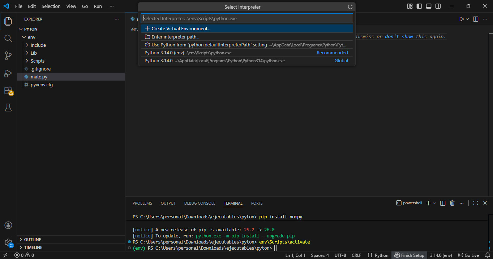
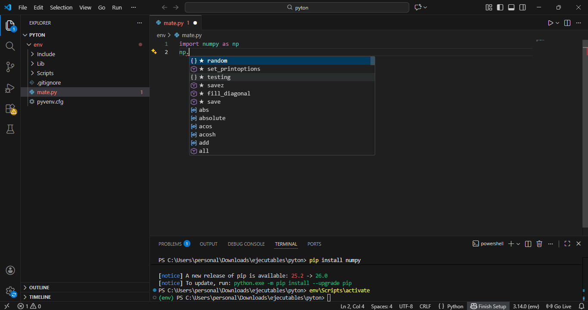

# Crear un entorno virtual de Python en VS Code (Windows)

### una guia para crear un **Entorno Virtual de Python** en el **Visual Studio Code**, lol.

---

## Requisitos:

- Python instalado (recomendado que se instale desde la pagina oficial de Python)
- Visual Studio Code
- Extensión de **Python** en el VS Code

---

## 1. Crear una carpeta para el entorno:

1. Crea una carpeta para el entorno (por ejemplo: `Python`)
2. Ábrela en el VS Code:
   - `Archivo > Abrir carpeta`

---

## 2. Crear el entorno virtual:

Abre la terminal de VS Code y ejecuta el siguiente comando:

```powershell
python -m venv env
```

Esto creará la carpeta llamada `env` con el entorno.

---

## 3. Activar el entorno virtual:

En la terminal de VS Code, ejecuta:

```powershell
env\Scripts\activate
```

Si salió bien, se vera `(env)` al inicio de la línea:

```powershell
(env) PS C:\Users\...\pyton>
```


---

## 4. Seleccionar el intérprete de Python en VS Code:

1. Presiona:
   ```
   Ctrl + Shift + P
   ```
2. Escribe:
   ```
   Python: Select Interpreter
   ```
3. Selecciona el intérprete que diga algo como:

```
Python 3.x (env) .\env\Scripts\python.exe
```



---

## 5. Instalar librerías dentro del entorno:

Con el entorno activado (`(env)` visible), instala las librerías usando el `pip` en la terminal:

```powershell
pip install numpy
```

---

## 6. Probar que funciona correctamente

En el archivo `mate.py`, escribe:

```python
import numpy as np

print(np.random.rand(3, 3))
```

Si VS Code muestra autocompletado (`np.random`, `np.array`, etc.), el entorno está instalado.



---

## ya se podria decir que se hizo el entorno virtual correctamente.